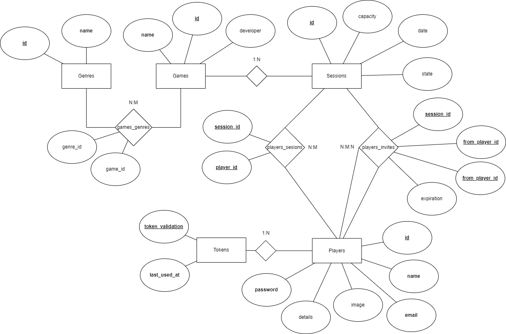

## Introduction

This document contains the relevant design and implementation aspects of LS project's second phase.

## Modeling the database

### Conceptual model ###

The following diagram holds the Entity-Relationship model for the information managed by the system.




We highlight the following aspects:

* Created a separate table for the genres since it falls on a separate category that is not directly related to games only and to improve readability and maintainability of the database.
* Created a separate table for the association between the games and the genres since a game might have different genres and a genre might be in several games at the same time.
* Created a separate table for the association between the players and the sessions since a player might be in several sessions at the same time and a session might have several players at the same time.
* Created a separate table for the association between two players and a session for a new implementation to create invites and store them.

The conceptual model has the following restrictions:

* While passing from the memory model to the JDBC database module some changes where done so the association between some tables where correctly implemented like the creation of extra tables.
* If a type of genre is not in the table genre, it needs to be added before adding the game to create a proper association.
* A game cannot exist without a genre, so the association between the game and the genre needs to be created before the game is created.

### Physical Model ###

The physical model of the database is available in [here](../src/main/sql/projectCreateSchema.sql).

We highlight the following aspects of this model:

* The emails from the players need to be unique.
* The name of the players also needs to be unique.
* The name for the game also needs to be unique.
* the name for the genres also needs to be unique.
* Every table has a serial id as the primary key and the foreign keys are also present in the tables.
* The games_genres table needs to have two foreign keys, one for the game and another for the genre to exist so if any of those tables disappears the association will also disappear.
* The sessions_players table needs to have two foreign keys, one for the session and another for the player to exist so if any of those tables disappears the association will also disappear.
* The player_invites table needs to have three foreign keys, one for the session and two others for the players so we know who sent the invite to who and to what session.
* It was added a description and an image to the players profile. The image is stored as a bytea in the database.
  Both of this will start as null once the player creates his account. It will be able to change this inside his profile.
  Note that only images that are PNG or JPEG are accepted.

## Software organization

### Open-API Specification ###

You can access the Yaml file [here](GameLink.yaml)

In our Open-API specification, we highlight the following aspects:

All server responses come in JSON notation and can be seperated into two categories for each datatype:
* Details
* Response
#### Details
These represent the information brought from GET requests for specific or item collections for Player, Game and Session.
#### Response
These represent the result of POST or PUT requests for specific or item collections for Player, Game and Session.


### Request Details

```
sessionsServer.kt -> sessionsWebApi.kt -> sessionsServices.kt -> sessionsDataMem.kt
```
or
```
sessionsServer.kt -> sessionsWebApi.kt -> sessionsServices.kt -> JDBCDatabase.kt
```
This represents the path a request makes in order to return information.\
It starts in sessionsServer where a Http4kServer is set up and is listening for incoming requests.\
Once found it is routed according to the description found in sessionsWebApi.kt. This description generates routes with the use of [Winter](WinterBoot.md) library.\
In the corresponding function the parameters are passed onto sessionsServices.kt that implements the interface SessionService.\
In the SessionService it then processes the information passed along and makes queries to sessionsDataMem or JDBCDatabase, or something else as long as it implements the interface SessionsData.

Non-Authorization request parameters are verified in the SessionsService module, in contrast, authorization parameters are verified in a filter before it reaches the controller functions.
The filter description is a class that generates a http4k Filter with the use of [Winter](WinterBoot.md) library.

### Connection Management


Connections are created with the use of a singleton class that creates a connection to the database and returns it to the user.
The connections are used to create statements that are used to execute the SQL commands. After the commands are executed the connection closes.
JDBCDatabase class does not explicitly define transaction scopes, it relies on the implicit transaction management provided by JDBC.
Each method call represents a transaction scope, and the database system handles transaction commit and rollback based on the success or failure of method executions.


### Data Access

We created 5 different classes to help with the data implementation: `Game`, `Session`, `Player`, `Token` and `Invites` each of them with their own values.

Apart from the normal SQL parts that we needed to do in order to create tables and insert or read values in them, we also created a SQL trigger to help with the deletion of expired tokens.
The token system for the player has also been improved so now the tokens only have 30min to live before they are deleted.
This adjustment was done on the JDBCDatabase class, so the token might actually live more than 30min.
This depends on the time the next request to update the table is made.
But we secured a way so that when we try to check if the user is authorized, a part of the code executes first updating the token last used time but before that it checks the last time it was used and of it was more than 30min ago, the token is erased.

Apart from this previous trigger, a similar approach was done to the invites.
In this case, we use a function in kotlin that is called before someone tries to get their invites.
When the player does, then it will check for the invites that are older than 5min and will erase them.

The way the images are for the players profiles are being stored is as a bytea in the database.
This way we can store the image in the database and retrieve it when needed.

### Error Handling/Processing

Errors are handled by the 4 Exception classes, which are classes that extend the Exception class and have a message that is shown when an error occurs.


### Front-end

On this phase we improved the front-end fo the project, using JS and CSS.
The front-end format is a Single Page Application (SPA) that uses the API to get the data and show it to the user.
The front-end is divided into several pages, each with its own purpose.
The schema that was asked at first by the teachers has been changed in several parts but maintaining the same idea.

* We changed is that in the GameSearch and SessionsSearch Page we include the list of games and sessions, respectively, in the same page, so the user can see all the information in the same page.
* We also added a page to see the invites received from other players to a session.
* We also added a way to invite players by partial names to a session on the session details page.
* We added a navigation bar to navigate between the pages once the player creates an account or logs in.
* We also added a page to search for a player by partial name so the user can see the player details.
* Another page was added to update the player details, including the image.
* We also added a page to create a new player.
* We also added a page to log in a player.

A file was created to use the elements from the html pages more easily, and it's easier to read. This file is called `DLS.js`.
Another was added to handle the errors that might occur in the front-end, called `errorHandler.js`.

The state for the session can be introduced with a default value, "Open" or "Closed".
We are using search by partial game Name since the user should not have access to any ids.
We are also using a search by partial player name since the user should not have access to any ids.
The date is passed using a Date and Time field in the javascript.

The game page both to create and search uses checkboxes to select the genres or developer.

Css was added to all the pages to make everything more attractive.


## Critical Evaluation

We didn't have time to add tests for the front-end part of the project, so there might be some things that are not displaying properly in certain cases as for example a session having tons of players inside it.

Some code on the front-end might be hard to understand at first, so maybe we should have separated in different files to make it easier to read.

There is also an improvement on the invites part that could have been added. The player that is trying to invite others can invite himself since if he search for his name it will appear.
Although, this is not a problem since the player can't invite himself to a session since he is already in it.

Perhaps more tests for the backend could also have been implemented to make sure that everything is working properly.
Tests to see if all the executions are being done properly and if the data is being stored correctly.


## Building
### You need to have at least Java 8 to compile and 17 to run (due to Jetty Dependency) instead then just execute: \
#### For Windows:
```
./build.bat
```
#### For Linux:
```
./build.sh
```
#### For Windows:
```
./start.bat
```
#### For Linux:
```
./start.sh
```